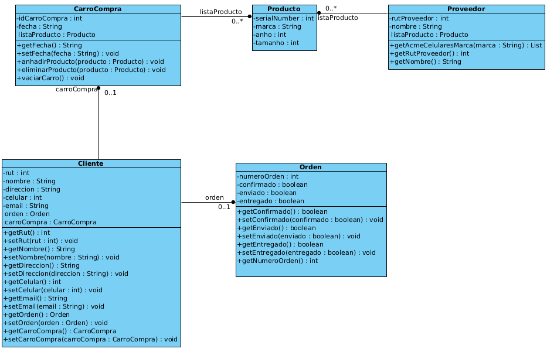

# Tarea 3: Patrón de Diseño Adaptador

---
Asignatura: Ingeniería de Software

Semestre: I-2024

Herramientas: IntelliJ + Java 17.

Fecha Entrega:  13-06-2024 18:00

---

## Pregunta 1

Usted como ingeniero de software ha sido contratado para mejorar un aplicativo de comercio electrónico de celulares. El sistema actualmente permite a los clientes realizar compras de productos, en este caso celulares, pero se ha identificado la necesidad de introducir mejoras al código. Actualmente el stock de productos lo mantiene el proveedor ACME, que ha tenido una capacidad limitada de abastecer el stock actual por causa del gran crecimiento que ha tenido la empresa en el último tiempo. Estos proveedores cuentan con sus sistemas y en particular, interfaces propias para la adquisición de productos. Por ejemplo, para adquirir celulares de PCFactory se requiere hacer una llamada de método **getPCFactoryCelularAnho(int anho)** por año y en el caso del proveedor Afel, se solicitan por el tamaño de la pantalla del celular, **getAfelCelularTamanho(int pulgadas)**.

Por lo tanto, se le ha encomendado la tarea de mejorarlo, utilizando el **patrón Adapter**, teniendo en cuenta los siguientes requisitos:

1. Debe implementa un mecanismo que permita que todos los proveedores de productos se comuniquen de manera uniforme con el sistema de compras;
2. Debe mantener la flexibilidad para agregar nuevos proveedores en el futuro sin cambiar el código existente;
3. No se debe modificar la clase del proveedor existente.

