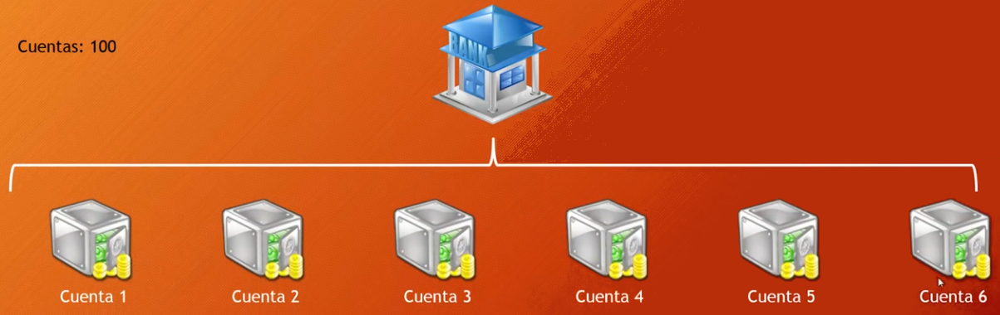

## Tarea N°2 - Patrones de Software y Programación 

## I-2024

## Entrega: Hasta el 20-06
  

Usted ha sido  contratado  para  analizar  la  simulación  de  un  sistema bancario  que  prontamente  pasará a ser  implementado. Este  sistema  simula la  tarea  de  realizar  transferencias  automáticas  de $100$ cuentas corrientes  enumeradas  del $0$ al $99$ y cada  una  con  un  saldo  inicial  de U$2000 dólares. Por  lo  tanto el banco  simulado solo puede  gestionar U$200.000 dólares  en total.

Además, las  transferencias son realizadas  en  forma  aleatoria  tanto  para la  cuenta  de  origen, la  cuenta  de  destino y el monto a ser  transferido y cada  una  de  estas  transferencias  es  realizada  por  un  hilo  de  ejecución diferente. Por  ejemplo, supongamos  que el sistema  realiza  una transferencia  desde  la  cuenta $1$ a la  cuenta $4$ de U$500 dólares, esto  resultará  en  que  la  cuenta $1$ tendrá  un  saldo final de U$1500 dólares y la  cuenta $4$ un  saldo final de U$2500 dólares. La  Figura  a continuación muestra el esquema  de  simulación  del  sistema  bancario  para $6$ cuentas, donde  infinitas  transferencias son realizadas. 

 El sistema  de  simulación  está  construido  en  lenguaje  *Java*  como  un  proyecto  *Maven*  diseñado  para  ser  ejecutado  en  modo consola. Está  compuesto  por $2$ paquetes: `cl.ucn.modelo`  que  contiene las  clases  de  modelo y `cl.ucn.principal`  que  contiene  una  clase principal. El primer paquete  contiene  las  dos  clases, `Banco.java` y `EjecucionTransferencias.java`  mientras  que el segundo  paquete solo contiene  la  clase  `Main.java`. Cada  vez  que  se  ejecute el programa, comenzarán  las  ejecuciones  de  las  transferencias sin parar  hasta  que usted  detenga  la  ejecución. Las  transacciones son registradas  en  un 
archivo  de  registro  ubicado  en  la  carpeta  `registros/transacciones.log`, donde  puede  observar  las  transferencias  realizadas (cuenta  de  origen, destino y cantidad), el monto total de  dinero  gestionado  por el banco y los  hilos  que  ejecutaron  la  transacción. Este  archivo  se  sobrescribe cada  vez  que  se  ejecuta  la  simulación.

  

## Preguntas 

1. Explique el problema  que  está  teniendo  la  simulación  al  ser ejecutado, de  acuerdo a lo  que  se  muestra  en el archivo `registros/transacciones.log`. Con solo $5$ segundos  de  ejecución  es suficiente  para  obtener  registros y notar el problema (**1 pt)**.

2. Implemente  la  solución  al  problema  detectado  explicando el mecanismo utilizado. Usted decide cual  mecanismo  será  utilizado y donde implementarlo  para resolver el problema, pero  debe  argumentar  la ventaja  del  mecanismo  escogido  por  sobre  los  otros  existentes (**3 pts**).

